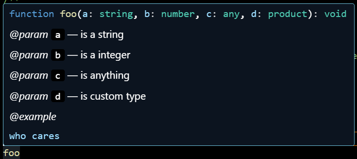
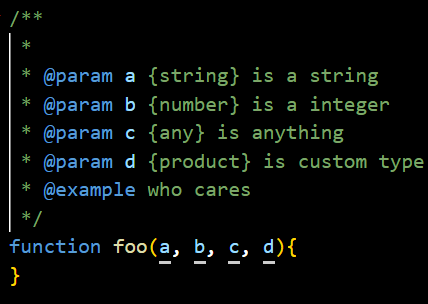
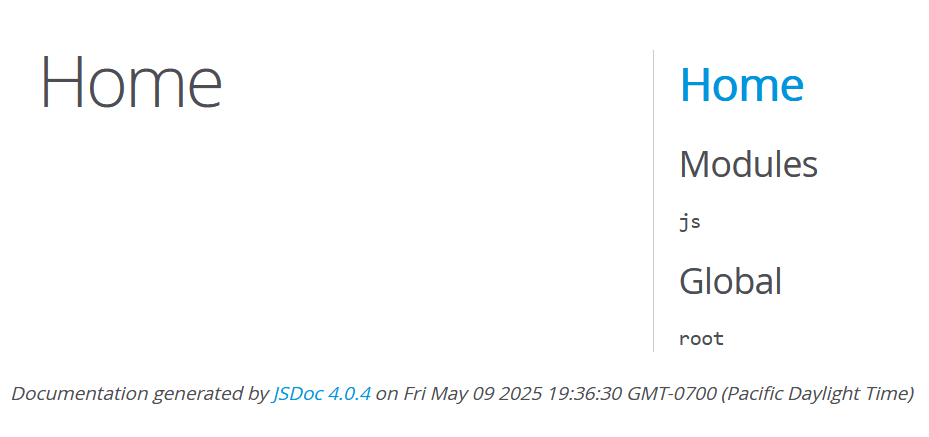
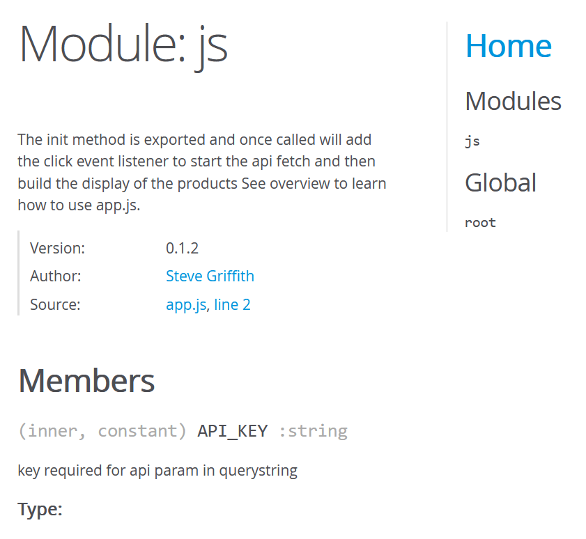

# This is a demo for JSDOC 
From Steve Griffith's video [Enhance your Coding with JSDoc](https://www.youtube.com/watch?v=3RIaH0NnG64)

I made a [all you need to know note](/JSdocs-note.md) for the JSdocs. 

# Result of Jsdocs

## vscode example
comment

Hovering

## generated html
Home page

Module
